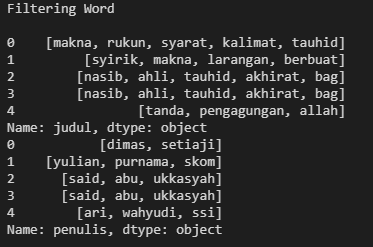
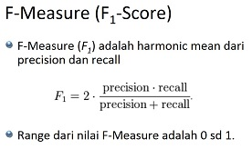

# Web Mining A 2021

Teknik Informatika Universitas Trunojoyo Madura

**Nama: Ahmad Wahyudi**

**NIM: 160411100093**

**Dosen Pengampu: Mula'ab, S.Si., M.Kom.**

## **Pengantar**
> Di zaman sekarang teknologi Internet telah berkembang dengan sangat pesat. Singkatnya kebutuhan akan informasi dan data sekarang tidak lepas dari mengakses Internet dan membuka website untuk menunjang pekerjaan sehari-hari seperti membaca berita, menulis, menonton hiburan, dan sebagainya. Namun karena Informasi dan data yang tersebar sangatlah banyak serta keterbatasan manusia dalam mengumpulkan informasi dan data yang dibutuhkan, maka manusia mulai memanfaatkan teknologi untuk memudahkan kita dalam melakukan pengumpulan informasi dan data. salah satunya adalah dengan melakukan **Web Crawling**.

## **Web Crawling**

### **Pengertian**

> **Web Crawling** atau biasa disebut dengan spiders adalah proses di mana mesin pencari mengirimkan tim robot (crawler atau spider) untuk menemukan konten baru dan konten yang telah di-update. Konten yang dimaksud bisa beragam, mulai dari sebuah dokumen, gambar, video, audio, dan lain sebagainya.

> Untuk melakukan web crawling, kita setidaknya harus memiliki pengetahuan dasar tentang **HTML** karena semua website yang akan kita crawling menggunakan teknologi tersebut. 

> Pada kesempatan kali ini, kita akan menggunakan bahasa pemrograman **Python** serta library **Scrapy** untuk melakukan proses crawling data. Website yang akan kita gunakan dalam ujicoba kali ini adalah [Muslim.or.id](https://www.muslim.or.id).

### **Uji Coba Web Crawling**
> Seperti yang telah disebutkan diatas bahwa website yang akan kita jadikan objek ujicoba adalah [Muslim.or.id](https://www.muslim.or.id) yang merupakan salah satu media Islam yang banyak membahas mengenai seputar hukum-hukum islam yang banyak mengandung manfaat bagi kaum muslimin. Artikel didalam website tersebut terdiri dari berbagai macam disiplin ilmu. 

> Pertama, kita tentukan terlebih dahulu halaman yang akan kita ekstrak datanya. 

[https://muslim.or.id/category/aqidah](https://muslim.or.id/category/aqidah)

Buka command prompt kemudian ketik:

    C:\Users\AHMAD WAHYUDI\Desktop>scrapy startproject muslim_project

Kemudian masuk kedalam direktori project:

    C:\Users\AHMAD WAHYUDI\Desktop>cd muslim_project


Masukkan link [https://muslim.or.id/category/aqidah](https://muslim.or.id/category/aqidah)

    C:\Users\AHMAD WAHYUDI\Desktop\muslim_project>scrapy genspider muslim https://muslim.or.id/category/aqidah


Buka folder `muslim_project`. Didalamnya akan terdapat folder `spiders` yang di *generate* dari hasil menjalankan perintah diatas. Didalam folder `spiders` akan ada file yang bernama `almanhaj`. Buka file tersebut dengan text-editor. Dalam hal ini saya menggunakan `Vs-Code`.
```python
import scrapy

class MuslimSpider(scrapy.Spider):
    name = 'muslim'
    allowed_domains = ['https://muslim.or.id/category/aqidah']
    start_urls = ['http://https://muslim.or.id/category/aqidah/']

    def parse(self, response):
        pass
```
Edit source code pada bagian 
```python 
def parse(self, response):
        pass 
```
sehingga menjadi seperti
```python
 def parse(self, response):
        data = response.css('.post-box')
        for item in data:
            title = item.css('.post-title a::text ').extract()
            author = item.css('.post-meta-author a::text').extract()
            yield{
                'Judul Artikel': title ,
                'Penulis': author
            }
```
 
#### Penjelasan Code

`data = response.css('.post-box')` - nama class dimana data yang akan diestrak berada.  

Karena kita akan mengambil nama judul dan nama penulis, kita perlu mengetahui nama class yang menampung judul dan penulis, maka 

```python
for item in data:
    title = item.css('.post-title a::text ').extract()
    author = item.css('.post-meta-author a::text').extract()
    yield{
        'Judul Artikel': title ,
        'Penulis': author
        }
```

Untuk melakukan ekstraksi data, buka terminal atau command prompt kemudian ketikkan perintah

    C:\Users\AHMAD WAHYUDI\Desktop\muslim_project> scrapy crawl muslim -o hasil.csv

Data yang kita crawl akan tersimpan dengan nama `hasil.csv`. Berikut isi dari file `hasil.csv`

```
judul,penulis
"Makna, Rukun dan Syarat Kalimat Tauhid",Dimas Setiaji
Makna Syirik dan Larangan Berbuat Syirik,"Yulian Purnama, S.Kom."
Nasib Ahli Tauhid di Akhirat (Bag. 2),Sa'id Abu Ukkasyah
Nasib Ahli Tauhid di Akhirat (Bag. 1),Sa'id Abu Ukkasyah
Tanda Pengagungan kepada Allah,"Ari Wahyudi, S.Si."
Pengaruh Nama dan Sifat Allah bagi Insan Beriman (Bag. 2),"dr. Adika Mianoki, Sp.S."
Pengaruh Nama dan Sifat Allah bagi Insan Beriman (Bag. 1),"dr. Adika Mianoki, Sp.S."
Ngaji Aqidah Sampai Kapan?,"Ari Wahyudi, S.Si."
Agama Para Rasul Itu Satu,"dr. M Saifudin Hakim, M.Sc., Ph.D."
Adakah Nabi dari Kalangan Wanita?,"dr. M Saifudin Hakim, M.Sc., Ph.D."
Adakah Rasul dari Kalangan Jin?,"dr. M Saifudin Hakim, M.Sc., Ph.D."
Tidak Ada Dukun Putih,"Yulian Purnama, S.Kom."
Larangan Sangat Keras Pergi ke Dukun,"dr. Adika Mianoki, Sp.S."
```


## **Text Preprocessing**

Setelah melakukan pengumpulan data maka kita akan lanjut ke tahap berikutnya yaitu **Text Preprocessing**.

 **Text Preprocessing** merupakan tahapan dimana data yang sudah kita dapatkan dari hasil crawling tadi diseleksi terlebih dahulu agar nantinya data yang kita olah lebih terstruktur.
 
 Sebenarnya tidak ada aturan tahapan yang pasti didalam proses Text Preprocessing karena semuanya bergantung pada jenis data dan hasil yang kita inginkan.
 Tetapi secara umum tahapan pada Text Preprocessing adalah *Case Folding, Tokenization dan Filtering, Stopword Removal, Stemming*. 

### Case Folding
Proses case folding bertujuan untuk mengubah semua huruf dalam sebuah dokumen teks menjadi huruf kecil (lowercase). Untuk proses ini kita bisa menggunakan fungsi lower() yang merupakaan bawaan dari python dan library pandas.

Pertama kita mulai dengan membaca file `hasil.csv` 

```python
import pandas as pd
data = pd.read_csv("hasil.csv")
data.head()
```

Outputnya:


Langkah selanjutnya, kita akan mengubah seluruh huruf didalam file `hasil.csv` menjadi lowercase seluruhnya dengan menggunakan perintah **lower()**

```python
def casefold(text):
    return str.lower(text)

print('Hasil Case Folding: \n')
for item in data:
    items = data[item] = (data[item].apply(casefold))
    print(items.head())
```

Outputnya:


### Tokenization dan Filtering

Pada tahapan **tokenization dan filtering** kita akan melakukan proses:
    
* menghilangkan angka pada teks
* menghilangkan tanda baca 
* ```word_tokenize``` - untuk memecah string kedalam tokens

**Menghilangkan angka pada teks**

Dengan memanfaatkan fungsi **str.replace**  yang merupakan bawaan dari Python kita akan menghapus angka pada teks

```python
def remove_number(text):
    return  re.sub(r"\d+", "", text)
print ('Hapus Angka: \n')
for item in data:
    items=data[item]=data[item].apply(remove_number)
    print(items.head())
```

Outputnya:


**Menghilangkan tanda baca pada teks**

Source code untuk menghapus tanda baca pada teks dengan kombinasi fungsi string **.translate** - **.maketrans** - **string.punctuation** 

```python
def remove_punctuation(text):
    return text.translate(str.maketrans("","",string.punctuation))

print ('Menghilangkan tanda baca: \n')
for item in data:
    items = data[item] = data[item].apply(remove_punctuation)
    print(items.head())
```

Outputnya:


**Word Tokenization**

Disini kita akan menggunakan libary nltk untuk memecah string kedalam tokens

```python
def word_tokenize_wrapper(text):
    return word_tokenize(text)
for item in data:
    item_tokens = data[item] = data[item].apply(word_tokenize_wrapper)
    print(item_tokens.head())
```

Outputnya:


**Frekuensi Token**

Untuk mendapatkan frekuensi dari proses tokenization kita menggunakan fungsi **FreqDist** dan **.most_common()** yang tersedia di nltk

```python
def freqDist_wrapper(text):
    return FreqDist(text)
print ('Frequency Tokens: \n')
for item in data:
    item_tokens_fdist = data[item] = data[item].apply(freqDist_wrapper)
    print(item_tokens_fdist.head().apply(lambda x:x.most_common()))
```

Outputnya:


**Filtering**

Pada Tahap ini dengan menggunakan stopword bahasa Indonesia dari library NLTK, kita akan melakukan filtering terhadap dataframe yang sudah mengalami proses tokenization

```python
list_stopwords = stopwords.words('indonesian')
list_stopwords = set(list_stopwords)
def stopwords_removal(words):
    return [word for word in words if word not in list_stopwords]
for item in data:
    item_tokens_WSW = item_tokens_fdist = data[item].apply(stopwords_removal)
    print (item_tokens_WSW.head())
```

Outputnya:



### Steeming

Steeming merupakan tahapan dimana kata yang sudah kita dapatkan ditransformasikan menjadi kata dasarnya. Contoh **membantu** ditransformasikan menjadi **bantu** dan seterusnya. Dalam tahapan ini kita akan menggunakan library python Sastrawi untuk melakukan proses Steeming.

```python
def stemm_wrapper(text):
    factory = StemmerFactory()
    stemmer = factory.create_stemmer()
    return stemmer.stem(text)
text = 'Steeming merupakan tahapan dimana kata yang sudah kita dapatkan ditransformasikan menjadi kata dasarnya. Contoh membantu ditransformasikan menjadi bantu dan seterusnya. Dalam tahapan ini kita akan menggunakan library python Sastrawi untuk melakukan proses Steeming.'
result = stemm_wrapper(text)
print (result)
```

Outputnya:

    ```
    steeming rupa tahap mana kata yang sudah kita dapat transformasi jadi kata dasar contoh bantu transformasi jadi bantu dan terus dalam tahap ini kita akan guna library python sastrawi untuk laku proses steeming
    ```


## Reduksi Dimensi

Reduksi Dimensi adalah teknik untuk mengurangi dimensi dataset dalam hal ini fitur data. Dataset yang berjumlah puluhan bahkan ratusan fitur atau kolom dapat kita kurangi jumlah fitur atau kolomnya tanpa menghilangkan informasi dari dataset.

Pada prinsipnya, reduksi dimensi sama dengan mengkompres file yang berukuran besar menjadi zip. Kompresi file tidak akan mengurangi informasi yang ada di dalam file tersebut, hanya membuatnya lebih sederhana sehingga mengurangi ukuran file yang dapat mempercepat proses transfer file.

### Implementasi Text Preprocessing

```python
import numpy as np
import PyPDF2
import doctest
import sys
from IPython.display import Image
from requests_html import HTMLSession
import matplotlib.pyplot as plt
%matplotlib inline 
import networkx as nx
from nltk.tokenize.punkt import PunktSentenceTokenizer
from sklearn.feature_extraction.text import TfidfTransformer, CountVectorizer
```

```python
session = HTMLSession()
r = session.get('https://muslim.or.id/65984-makna-syirik-dan-larangan-berbuat-syirik.html')
articles = r.html.find('div.post-65984')

for item in articles:
    docsitem = item.find('div.entry', first = True)
    docs = docsitem.text
    print(docs)
```

```python
doc_tokenizer = PunktSentenceTokenizer()
sentences_list = doc_tokenizer.tokenize(news)
type(sentences_list)
```


```python
import string
from Sastrawi.Stemmer.StemmerFactory import StemmerFactory
factory = StemmerFactory()
stemmer = factory.create_stemmer()
import re
docsre = []
for item in sentences_list:
    result = re.sub(r"\d+","",item)
    docsre.append(result)
print (docsre)
```


```python
len(docsre)
docs = []
for item in docsre:
    result = item.replace ('\n','')
    docs.append(result)
print(docs)
```

```python
from Sastrawi.StopWordRemover.StopWordRemoverFactory import StopWordRemoverFactory
from nltk.tokenize import word_tokenize
factory = StopWordRemoverFactory()
stopword  = factory.create_stop_word_remover()

len_docs= len(docs)
docsstop = []
for item in range (0, len_docs):
    sentence = stopword.remove(docs[item])
    docsstop.append(sentence)
print(docsstop)
```

```python
cv = CountVectorizer()
cv_matrix = cv.fit_transform(docs)
a = cv_matrix.toarray()
a.shape
```

```python
factory = StemmerFactory()
stemmer = factory.create_stemmer()
docsstemm = []
for item in docsstop:
    output_stemm = stemmer.stem(item)
    docsstemm.append(output_stemm)
print(docsstemm)
```


```python
bag = cv.fit_transform(docsstemm)
print(cv.vocabulary_)
```


```python
print(cv.get_feature_names())
len(cv.get_feature_names())
bag = cv.fit_transform(docsstemm)
matrik_vsm = bag.toarray()
matrik_vsm.shape
matrik_vsm[0]
```


```python
import pandas as pd
a = cv.get_feature_names()
print(len(matrik_vsm[:,1]))
print(len(matrik_vsm[:,1]))
dfb = pd.DataFrame(data=matrik_vsm, index= list(range(1, len(matrik_vsm[:,1])+1,)), columns=[a])
dfb
```


```python
from sklearn.feature_extraction.text import TfidfTransformer
from sklearn.preprocessing import normalize
# normed_x = normalize(x, axis=0, norm='l2')
tfidf  = TfidfTransformer(use_idf=True,norm='l2',smooth_idf=True)
tf= tfidf.fit_transform(cv.fit_transform(docsstemm)).toarray()
dfb = pd.DataFrame(data=tf, index=list(range(1, len(tf[:,1])+1,)),columns=[a])
dfb
```

## Modelling 
Dalam Text Modelling kali ini kita akan meringkas dokumen menggunakan metode LSA (Latent Semantic Analysis) juga dikenal sebagai LSI (Latent Semantic Index) LSA menggunakan bag of word(BoW) model, yang menghasilkan term-document matrix (kemunculan term dalam sebuah dokumen). Baris mewakili istilah dan kolom mewakili dokumen.  LSA biasanya digunakan sebagai teknik pengurangan dimensi atau pengurangan kebisingan.

Dokumen yang kita gunakan adalah artikel dari [muslim.or.id](https://muslim.or.id/65984-makna-syirik-dan-larangan-berbuat-syirik.html)

Implementasi Text Modelling:

```python
import codecs
import string 
import operator
import numpy as np
from nltk.tokenize import sent_tokenize
from nltk.corpus import stopwords
from sklearn.feature_extraction.text import TfidfVectorizer
from sklearn.utils.extmath import randomized_svd
from requests_html import HTMLSession
from Sastrawi.Stemmer.StemmerFactory import StemmerFactory# create stemmer
from Sastrawi.StopWordRemover.StopWordRemoverFactory import StopWordRemoverFactory #untuk stopword remove
from nltk.tokenize.punkt import PunktSentenceTokenizer

session = HTMLSession()
r = session.get('https://muslim.or.id/65984-makna-syirik-dan-larangan-berbuat-syirik.html')
articles = r.html.find('div.post-65984')

for item in articles:
    newsitem = item.find('div.entry', first = True)
    news = newsitem.text
    print(news)
sent_tokenize_list = sent_tokenize(news)
stopwords= set(StopWordRemoverFactory().get_stop_words())
#Menghitung TF-IDF
vectorizer = TfidfVectorizer(stop_words=stopwords, use_idf=True, ngram_range = (1, 3))
X = vectorizer.fit_transform(sent_tokenize_list) 
X_T = np.transpose(X)
U, Sigma, VT = randomized_svd(X_T, n_components=100, n_iter=100, random_state=None)
k = 4
temp_k = k
i = 0 
index = 0 
output = []
index_list = []

if temp_k <= 4:
    dic = {}
    for j in range(0, len(VT[0])):
        dic[j] = VT[0][j]
    dic_sort = sorted(dic.items(), key=operator.itemgetter(1))

    index1 = dic_sort[-1][0]
    index2 = dic_sort[-2][0]
    index3 = dic_sort[-3][0]
    index4 = dic_sort[-4][0]
    list = [index1, index2,index3,index4]
    list = sorted(list)
    if k == 1:
        output.append(sent_tokenize_list[list[0]])
    if k == 2:
        output.append(sent_tokenize_list[list[0]])
        output.append(sent_tokenize_list[list[1]])
    if k ==3:
        output.append(sent_tokenize_list[list[0]])
        output.append(sent_tokenize_list[list[1]])
        output.append(sent_tokenize_list[list[2]])
    if k ==4:
        output.append(sent_tokenize_list[list[0]])
        output.append(sent_tokenize_list[list[1]])
        output.append(sent_tokenize_list[list[2]])
        output.append(sent_tokenize_list[list[3]])

summarized_text = " ".join(output)

print("Hasil rangkuman: \n",summarized_text)

```

Evaluasi 
Evaluasi ringkasan otomatis dapat dilakukan dengan banyak cara. Yang paling sering digunakan adalah ROUGE-n. ROUGE sendiri merupakan seperangkat metrik untuk mengevaluasi ringkasan teks otomatis yang bekerja dengan cara membandingkan suatu ringkasan otomatis atau terjemahan dengan seperangkat rangkuman referensi.

Pengukuran ROUGE terbagi menjadi beberapa:

* ROUGE-N yang digunakan untuk mengukur unigram, bigram, trigram, dan n-gram yang lebih tinggi lagi

* ROUGE-L yang digunakan untuk mengukur pencocokan kata terpanjang menggunakan LCS.
* ROUGE-S yang juga bisa disebut sebagai skip-gram cooccurence. Misalnya, skip-bigram mengukur overlap dari pasangan kata yang memiliki jumlah gaps maksimum sebanyak dua pada setiap kata.

* ROUGE-SU merupakan pengembangan dari 

* ROUGE-S yang memperhatikan unigram.

* ROUGE-W yang menggunakan LCS namun tidak memberikan preferensi pada kalimat yang emiliki kata-kata yang lebih berurutan.

Untuk mengukur keakuratan ringkasan harus menghitung Precision, Recall, dan F-Measure.

* Rumus menghitung recall adalah banyaknya kata yang overlap dibagi dengan banyaknya kata pada ringkasan rujukan.

* Rumus menghitung Precision adalah banyaknya kata yang overlap dibagi dengan banyaknya kata pada ringkasan mesin

F-Measure merupakan salah satu perhitungan evalusasi dalam informasi temu kembali yang mengkombinasikan recall dan precission. Nilai recall  dan Precission pada suatu keadaan dapat memiliki bobot yang berbeda. Ukuran yang menampilkan timbal balik antara Recall dan Precission adalah F-Measure yang merupakan bobot harmonic mean dan reall dan precission.




Implementasi program:

```python
from rouge.rouge import rouge_n_sentence_level
summary_sentence = 'Awal terjadinya kesyirikan adalah di zaman Nabi Nuh ‘alaihissalam'.split()
reference_sentence = 'Di zaman Nabi Nuh ‘alaihissalam adalah awal terjadinya kesyirikan'.split()

#Menghitung nilai rouge
recall, precision, rouge = rouge_n_sentence_level(summary_sentence, reference_sentence, 2)
print ('ROUGE-2-R', recall)
print ('ROUGE-2-P', precision)
print ('ROUGE-2-F', rouge)
```

Output: 

```output
ROUGE-2-R 0.5
ROUGE-2-P 0.5
ROUGE-2-F 0.5
```